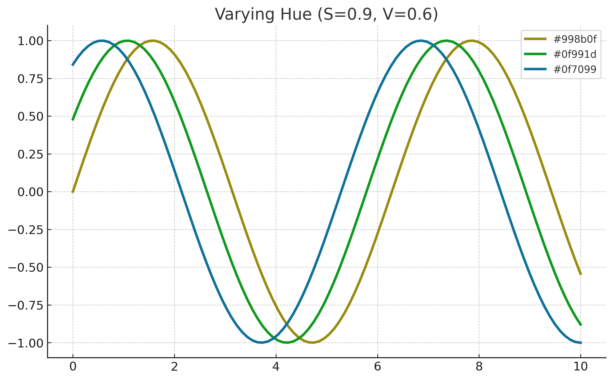
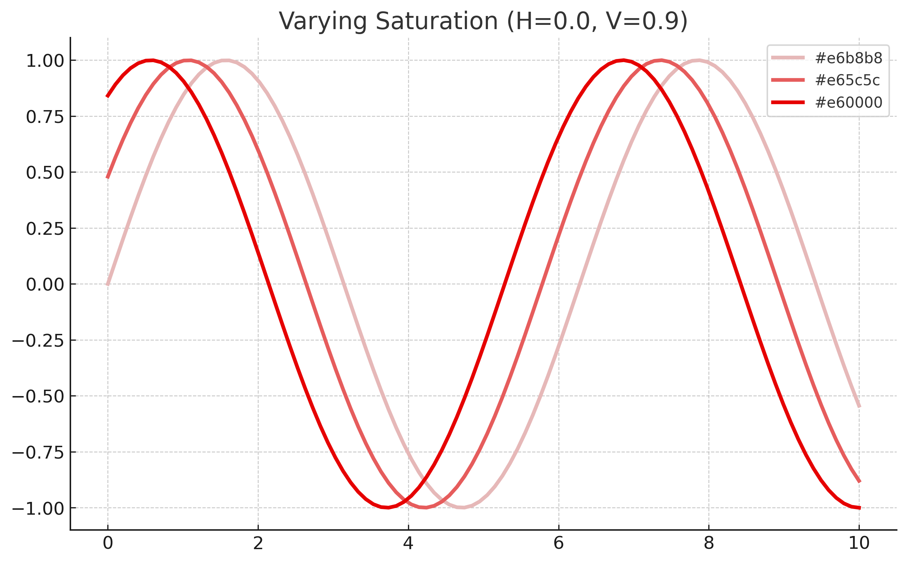
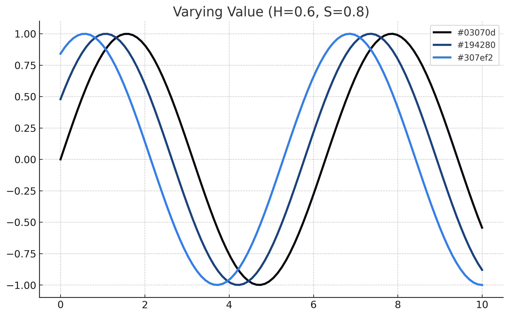

# XKCD Color Sorter

This project visualizes and organizes the [XKCD color survey](https://blog.xkcd.com/2010/05/03/color-survey-results/), which includes 949 uniquely named colors crowdsourced from hundreds of thousands of users.

The goal is to help designers, artists, and developers select perceptually balanced and harmonious color palettes. We do this by sorting the XKCD colors based on **combinations of HSV (Hue, Saturation, Value)** components, which better align with human perception than RGB.

## 🔍 Why This Matters

In visual design, colors with the same saturation and brightness but different hues appear more balanced than arbitrary combinations. This project helps you:
- Choose consistent sets of colors.
- Avoid colors that unintentionally dominate due to high brightness or saturation.
- Better understand how hue, saturation, and value individually affect perception.

---

## ✨ Features

- Parses XKCD's `rgb.txt` file.
- Converts RGB hex to HSV format.
- Groups colors based on two fixed HSV dimensions and sorts by the third:
  - Sorted by Hue within Saturation & Value
  - Sorted by Saturation within Hue & Value
  - Sorted by Value within Hue & Saturation
- Outputs well-formatted **PDF swatch books** using ReportLab.

---

## 📄 Output Examples

- 📘 [`all_xkcd_colors_sorted_by_Hue_within_Saturation_and_Value.pdf`](all_xkcd_colors_sorted_by_Hue_within_Saturation_and_Value.pdf)
- 📗 [`all_xkcd_colors_sorted_by_Saturation_within_Hue_and_Value.pdf`](all_xkcd_colors_sorted_by_Saturation_within_Hue_and_Value.pdf)
- 📕 [`all_xkcd_colors_sorted_by_Value_within_Hue_and_Saturation.pdf`](all_xkcd_colors_sorted_by_Value_within_Hue_and_Saturation.pdf)

Each color entry includes:
- A color swatch
- Name 
- HSV values

---

## 📊 Why HSV Matters: A Visual Example

These plots illustrate how varying **one HSV component** while keeping the others constant dramatically affects color perception.

### 1. Varying Hue (S=0.9, V=0.6)
Hue spans yellow → green → cyan  


### 2. Varying Saturation (H=0.0, V=0.9)
Saturation fades from grayish to vivid red  


### 3. Varying Value (H=0.6, S=0.8)
Value shifts from dark to bright purple  


These figures are especially useful in data visualization and interface design to avoid unintentional emphasis.

---

## 🛠 Installation

```bash
pip install pandas reportlab
